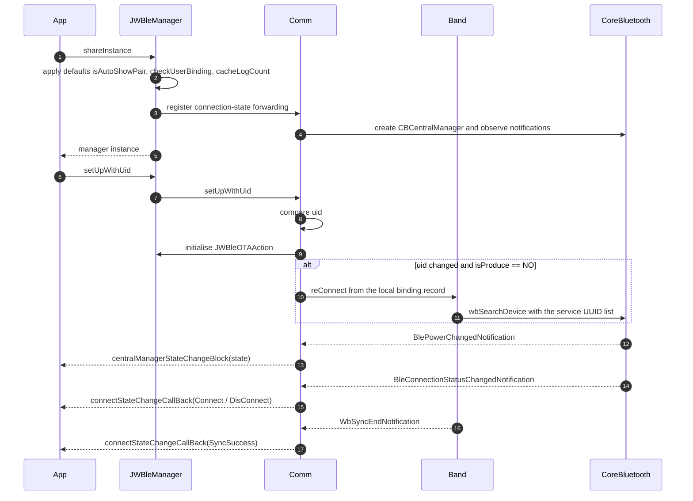
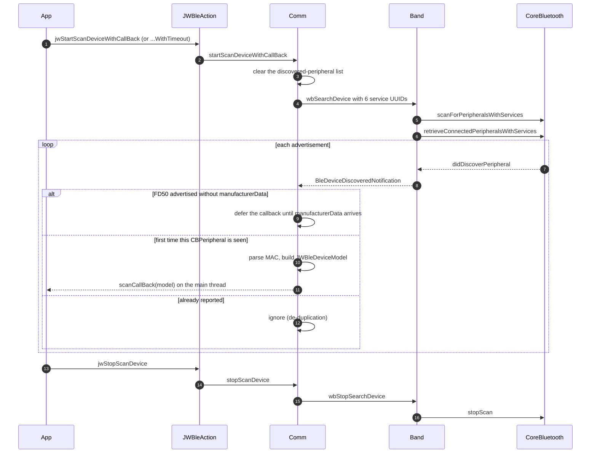
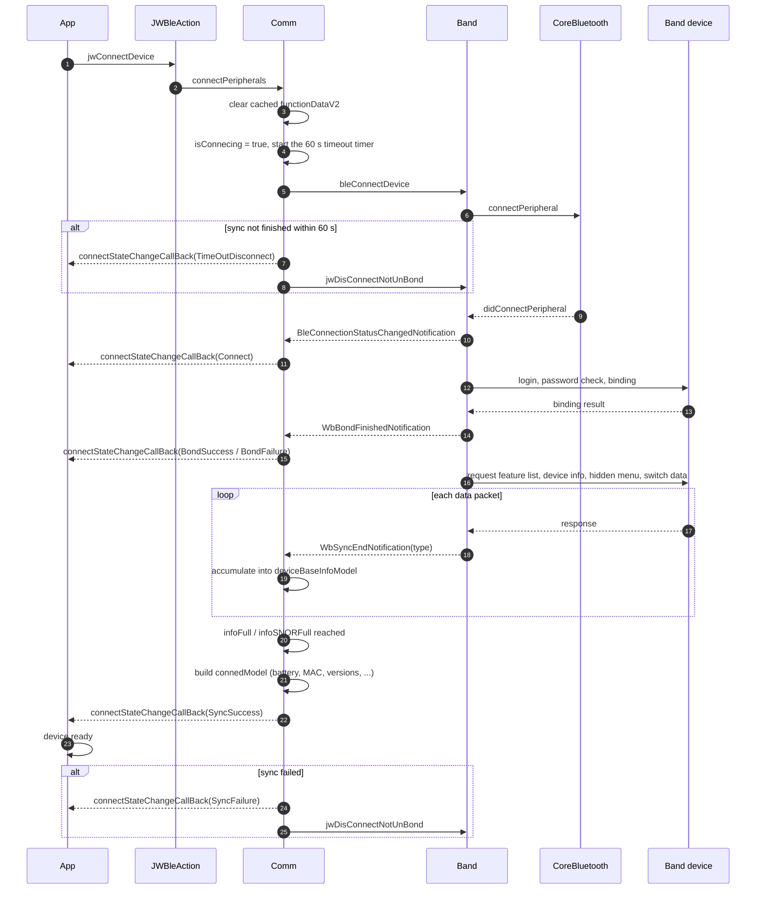
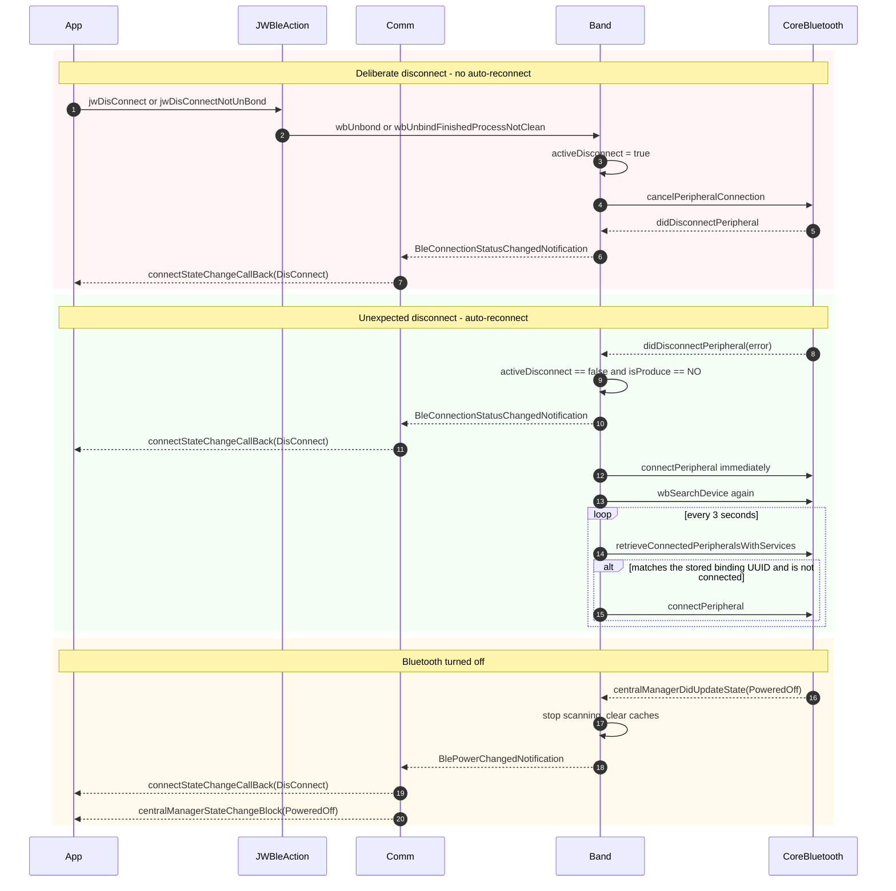
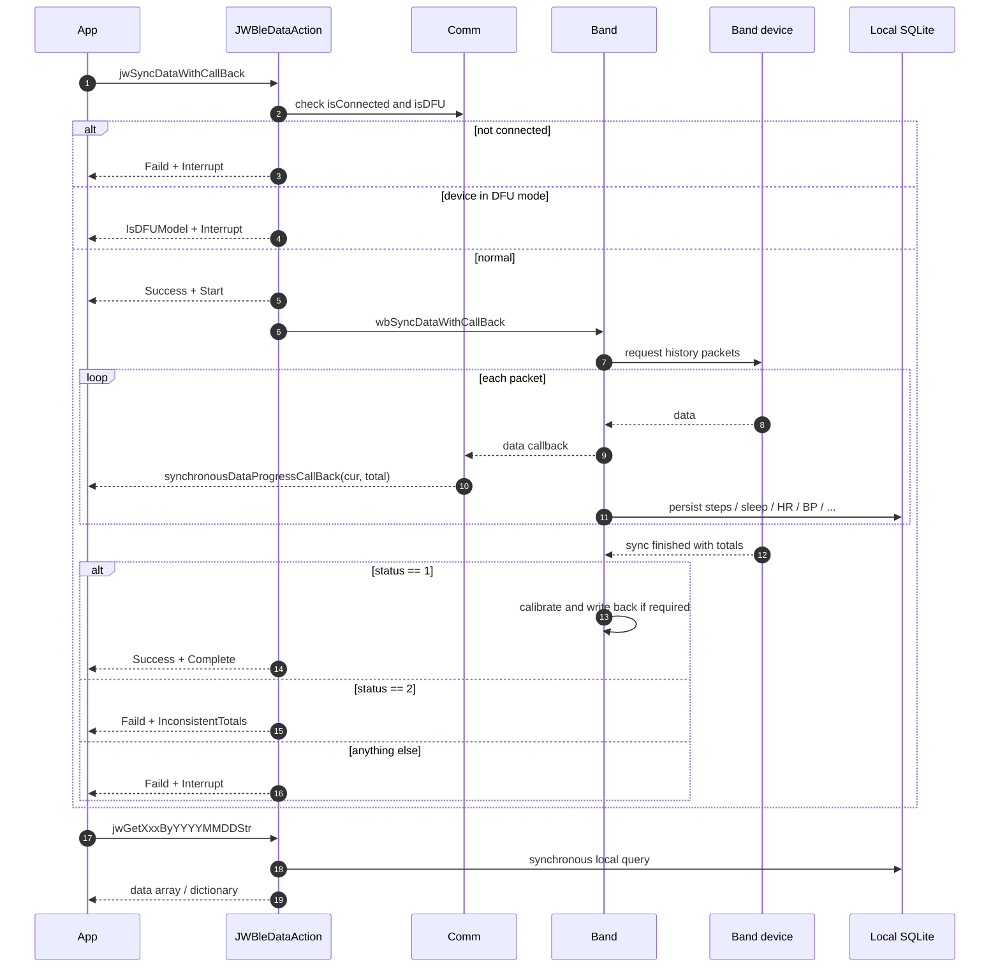
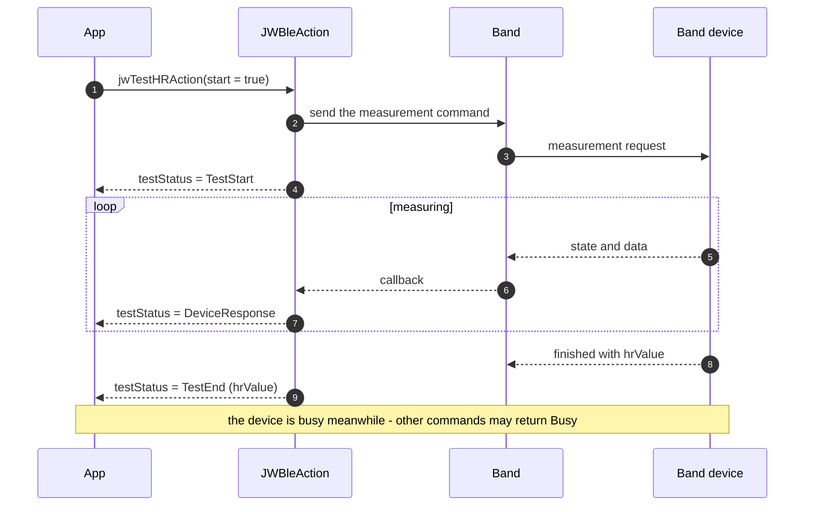
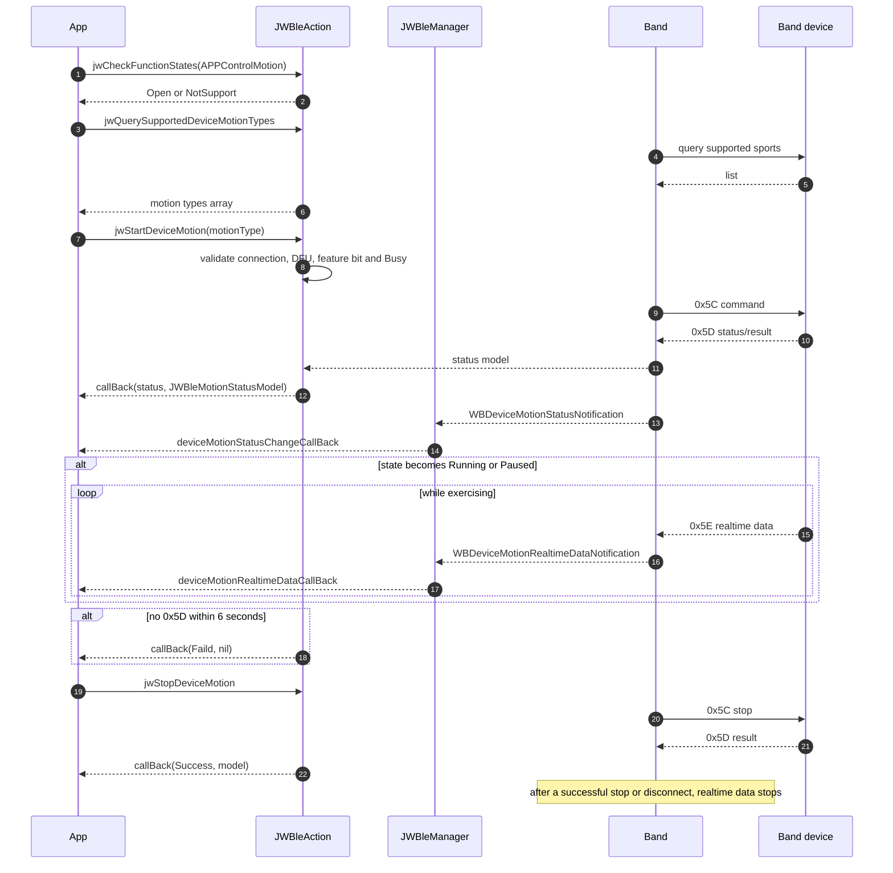
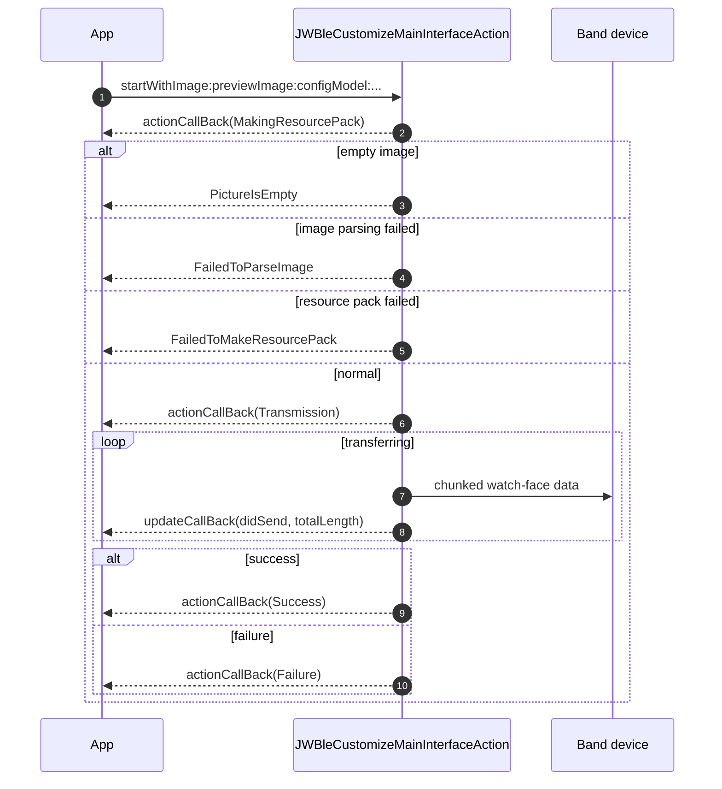

# JWBle SDK Call Flow Diagrams

> 🌐 Language: [中文](SDK调用时序图.md) ｜ **English**

> All diagrams are drawn from the current SDK source (`JWBleManager`, `JWBleCommunicationManager`, `WristBand`, `WristBandEvent`, `JWBleAction`, `JWBleDataAction`, `JWBleOTAAction`).
> "Comm" = `JWBleCommunicationManager` and "Band" = `WristBand`; both are internal implementation classes. Third parties only see `JWBleManager` / `JWBleAction` / `JWBleDataAction` / `JWBleOTAAction`.

---

## 1. SDK initialisation



Key points: auto-reconnect is not attempted before `setUpWithUid:`; an identical `uid` is ignored; the Bluetooth state callback is registered during initialisation.

---

## 2. Device scanning



Key points: scanning never stops by itself (unless you use the timeout variant), and each peripheral is only reported once.

---

## 3. Device connection (binding and sync)



Four layers: `Connect` (BLE link only) → `BondSuccess` (login/binding) → `SyncSuccess` (device info ready = device ready) → business commands allowed.

---

## 4. Disconnect and auto-reconnect



Key point: auto-reconnect is controlled **only** by `isProduce` — there is no public toggle and no retry limit.

---

## 5. Health data sync



Key point: read APIs never touch the device; since 2026-09-29 they are purely read-only (no implicit deletion).

---

## 6. Spot measurement (heart rate)



---

## 7. Multi-sport control



---

## 8. OTA upgrade

```mermaid
sequenceDiagram
    autonumber
    participant App
    participant Act as JWBleAction
    participant OTA as JWBleOTAAction
    participant RTK as RTKDFUUpgrade
    participant Dev as Band device

    App->>Act: jwCheckOTAEnableWithCallBack
    Act->>Dev: query device state
    Dev-->>Act: deviceStatus
    Act-->>App: status + deviceStatus (0 = ready to upgrade, 1 = device busy, other = not ready; -1 when the request failed)

    App->>OTA: startOTAV2ForWithData:prefersUpgradeUsingOTAMode:
    alt empty firmware data
        OTA-->>App: FileNotExist
    else no available peripheral
        OTA-->>App: PeripheralIsNull
    else normal
        OTA->>RTK: initWithPeripheral, prepareForUpgrade
        RTK-->>OTA: ready
        OTA-->>App: Start
        loop transferring
            RTK->>Dev: chunked write
            RTK-->>OTA: progress
            OTA-->>App: Updating(didSend, totalLength)
        end
        alt success
            OTA-->>App: Success
        else failure
            OTA-->>App: Failure
        else FSBL check enabled and version matches
            OTA-->>App: VersionConsistent
        end
        Note over OTA,Dev: otaIng is true during the upgrade; scan requests are ignored
    end
```

---

## 9. Watch face customisation



---

## 10. Diagram index

| Flow | Entry point | Result callback |
| --- | --- | --- |
| SDK init | `shareInstance` + `setUpWithUid:` | `centralManagerStateChangeBlock`, `connectStateChangeCallBack` |
| Scan | `jwStartScanDeviceWithCallBack:` | `JWBleReceiveScanningDeviceCallBack` |
| Connect | `jwConnectDevice:` | `connectStateChangeCallBack` (`Connect` → `BondSuccess` → `SyncSuccess`) |
| Disconnect / reconnect | `jwDisConnect` etc. | `connectStateChangeCallBack` (`DisConnect` / `TimeOutDisconnect`) |
| Data sync | `jwSyncDataWithCallBack:` | `JWBleSyncCallBack` + `synchronousDataProgressCallBack` |
| Data read | `JWBleDataAction` getters | in-method block (local DB) |
| Spot measurement | `jwTestHRAction:` etc. | in-method block (state machine) |
| Multi-sport | `jwStartDeviceMotion:` etc. | in-method block + 2 property callbacks |
| OTA | `startOTAV2ForWithData:…` | `JWBleDFUCallBack` |
| Watch face | `startWithImage:…` | `JWBleCustomizeMainInterfaceActionCallBack` + `JWBleDFUCallBack` |
