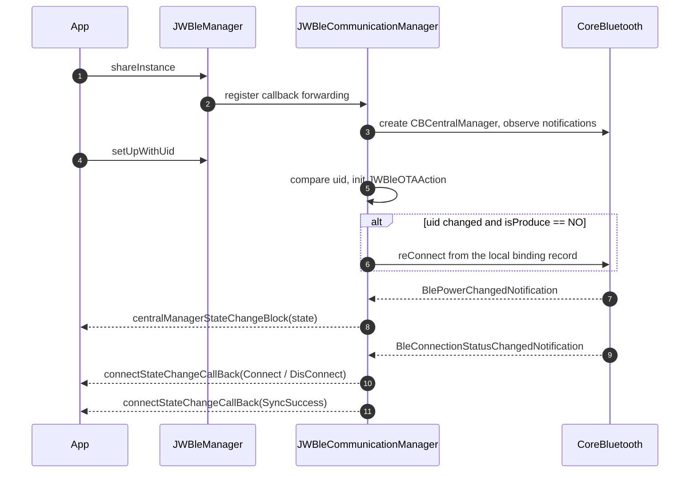

# JWBle SDK Integration Guide

> 🌐 Language: [中文](SDK接入指南.md) ｜ **English**

> Audience: third-party developers. All content is derived from the current SDK source code, the public headers, the shipped `JWBle.framework` headers and the documents inside the repository.
> This guide matches the shipped `JWBle.framework` (**1.3.2**); every sample below runs as-is in the bundled demo projects (`iOS/JWBleSdkDemo`, `iOS/JWBleProtocolDemo`).

- Document baseline: repository `Develop` branch, HEAD `38d7007`
- Scope analysed: `JWBle/JWBle/**` (SDK source and public headers), `JWBleDemo/JWBleDemo/Vender/JWBle/**` (shipped artifacts), `docs/**`, `JWBle/JWBle/Version Description.md`, `README.md`
- Coverage: the shipped `JWBle.framework` public headers, `iOS/JWBleSdkDemo` (full feature demo), `iOS/JWBleProtocolDemo` (protocol debug demo) and `Version Description.md`.

---

## 1. SDK Overview

### 1.1 Basic facts

| Item | Value | Evidence |
| --- | --- | --- |
| SDK name | JWBle (Wo-Smart wearable BLE SDK) | `JWBle/JWBle/JWBle.h` |
| Source project | `JWBle/JWBle.xcodeproj`, target `JWBle` | project file |
| Product name | `JWBle.framework` | `productType = com.apple.product-type.framework` |
| Bundle Identifier | `com.wosmart.JWBle` | `PRODUCT_BUNDLE_IDENTIFIER` |
| Platforms | iOS (iPhone / iPad) | `TARGETED_DEVICE_FAMILY = "1,2"` |
| Minimum OS | iOS 8.0 | `IPHONEOS_DEPLOYMENT_TARGET = 8.0`; shipped framework `MinimumOSVersion = 8.0` |
| Binary form | **Static library packaged as `.framework`** (`MACH_O_TYPE = staticlib`) | project settings; `nm` reports `ar archive` |
| Devices | Yes (arm64 slice present) | `lipo -info` on the shipped artifact |
| Simulator | **Partial**: only an `x86_64` simulator slice; **no arm64 simulator slice** | `lipo -info` |
| Module | Yes (`DEFINES_MODULE = YES`, ships a `module.modulemap`, supports `@import JWBle;`) | project settings + `Modules/module.modulemap` |
| Swift | Supported (module + umbrella header; Objective-C API is bridged for Swift) | `module.modulemap` |
| Runtime version | `1.3.2` | `-[JWBleManager sdkInfo]` |
| Bundle version | `1.3.2` (unified on 2026-09-29) | `JWBle/JWBle/Info.plist` |
| Latest changelog entry | `1.3.2` | `JWBle/JWBle/Version Description.md` |

> Version numbers were previously inconsistent (`sdkInfo` 1.3.2 vs `Info.plist` / changelog 1.0.2). They are unified to **1.3.2**: `JWBleManager.m` defines `kJWBleSDKVersion` as the runtime single source of truth, and `Info.plist` / `Version Description.md` were aligned. A *static* library cannot read its own Info.plist via `[NSBundle bundleForClass:]` (it resolves to the host app bundle) — that is why the constant exists.
>
> Read the version at runtime instead of hard-coding it:
> ```objc
> NSString *info = [[JWBleManager shareInstance] sdkInfo];
> NSDictionary *dic = [[JWBleManager shareInstance] sdkInfoDic];
> ```

### 1.2 SDK dependencies

All of the following ship with the repository and must be imported together with the SDK:

| Dependency | Form | Location | Purpose |
| --- | --- | --- | --- |
| `RTKLEFoundation.xcframework` | Dynamic (`ios-arm64`, `ios-arm64_x86_64-simulator`) | `JWBleDemo/JWBleDemo/Vender/JWBle/` | BLE foundation |
| `RTKOTASDK.xcframework` | Dynamic (same slices) | same | OTA/DFU (`JWBleOTAAction.m`) |
| `CocoaLumberjack.framework` | Static, embedded in `JWBle.framework/Frameworks/` | same | Logging |
| `Zip.framework` | Static | `JWBle/JWBle/Vender/DFU/` | Unzipping dial resource packs |
| `iOSDFULibrary.framework` | Static | `iOS/SDK/` | Nordic DFU channel; this release's public OTA path uses the RTK channel (`RTKOTASDK`) and the SDK does not reference this library — include it only if you need the Nordic DFU channel |
| `RTKAudioConnectSDK.framework` | Dynamic | `iOS/SDK/` | Headset / audio features; not exposed by `JWBle.framework` — include it only when your app needs headset features (the demo's headset page uses it) |
| `libotaclient.a` | Static | `JWBle/JWBle/RTK/Vender/` | OTA low level |
| `FMDB` | Source | `JWBle/JWBle/RTK/FMDB/` | Local data cache database |

System frameworks: `Foundation`, `UIKit`, `CoreBluetooth`, `Security` (AES).
`HealthKit` is **not** required (`+[Misc addHealthKitSupport]` is an empty stub). `CoreLocation` is **not** used anywhere.

---

## 2. Requirements

| Item | Requirement |
| --- | --- |
| Toolchain | Xcode (the shipped artifact was built with Xcode 16.2 / iOS SDK 18.2) |
| Language | Objective-C SDK; usable from Swift via the module or a bridging header |
| Deployment | iOS 8.0+ (the shipped framework's minimum deployment target is 8.0). Set your own app's deployment target: Xcode 15+ requires ≥ iOS 12.0, Xcode 26/27 requires ≥ iOS 15.0 |
| Device | Required — BLE cannot be exercised on a simulator |
| Permission | Bluetooth: `NSBluetoothAlwaysUsageDescription` (iOS 13+) and `NSBluetoothPeripheralUsageDescription` (iOS 12 and below) |

---

## 3. Integration

> There is **no** CocoaPods (`Podfile`/`*.podspec`) or Swift Package Manager (`Package.swift`) setup in this repository, only embedded frameworks.
> Integration is **manual framework import (+ dependencies) only** — no CocoaPods or Swift Package Manager package is provided.

### 3.1 Manual integration

**Step 1 — add the main framework**

- Drag `JWBle.framework` into the app target.
- Because it is a **static** framework, set **Embed = `Do Not Embed`**.

**Step 2 — add the dependencies**

Add `RTKLEFoundation.xcframework`, `RTKOTASDK.xcframework` (both *Embed & Sign*), plus the DFU pieces (`Zip.framework`, `iOSDFULibrary.framework`, `libotaclient.a`) and `RTKAudioConnectSDK.framework` if headset features are needed. `CocoaLumberjack.framework` is already embedded inside `JWBle.framework/Frameworks/`.

**Step 3 — build settings**

| Setting | Value | Why |
| --- | --- | --- |
| `Framework Search Paths` | Paths to `JWBle.framework` and the dependencies | Enables `#import <JWBle/JWBle.h>` |
| `Other Linker Flags` | **You must add `-ObjC`** | The SDK uses categories (`CBPeripheral+Write`, `NSString+JWBle`, …). Without `-ObjC` a static library drops them and the app crashes with `unrecognized selector`. The SDK project itself previously contained a full-width `"－ObjC"` (ineffective) — that typo is fixed, but your app must still add the flag explicitly |
| `Other Linker Flags` (if symbols are missing) | add `-lz`, `-lsqlite3` | `Zip.framework`, FMDB |
| `Always Embed Swift Standard Libraries` | enable for pure Objective-C apps | `Zip.framework` / `CocoaLumberjack.framework` contain Swift |

**Step 4 — import headers**

```objc
#import <JWBle/JWBle.h>
```

**Step 5 — Info.plist**

```xml
<key>NSBluetoothAlwaysUsageDescription</key>
<string>Bluetooth is required to connect to your wearable device</string>
<key>NSBluetoothPeripheralUsageDescription</key>
<string>Bluetooth is required to connect to your wearable device</string>
```

System capabilities actually required by the SDK:

| Capability | Required | Notes |
| --- | --- | --- |
| Bluetooth permission | Yes | `CBCentralManager` based scanning/connecting |
| Location permission | No | No location APIs are used |
| Background Modes | Optional | Reconnect works while the app process is alive. To keep/recover the link in the background, declare `bluetooth-central` in your target; the SDK does not use CoreBluetooth state restoration, so background behaviour follows your declaration |
| HealthKit | No | Not invoked |
| Networking | No | The SDK performs no network requests |
| Notification permission | No | Notification toggles are forwarded to the band; no local notification permission is requested |

---

## 4. Initialisation

### 4.1 Entry point

```objc
JWBleManager *manager = [JWBleManager shareInstance];
[manager setUpWithUid:@"your-user-id"];   // required
```

- `shareInstance` creates the singleton on first use (defaults: `isAutoShowPair = YES`, `checkUserBinding = YES`, `cacheLogCount = 30`) and registers all callback forwarding.
- `setUpWithUid:` is **mandatory**. It binds the SDK to an app-side account id (device ownership/binding semantics). Calling it again with the same `uid` is ignored by design.

### 4.2 Initialisation sequence



### 4.3 Callbacks you must register

| Callback | Purpose | Required |
| --- | --- | --- |
| `JWBleManager.connectStateChangeCallBack` | All connection-class events (connect/bind/sync/disconnect/battery/charging/timeout/…) | Yes |
| `JWBleManager.centralManagerStateChangeBlock` | Phone Bluetooth power state | Strongly recommended |
| `JWBleManager.synchronousDataProgressCallBack` | History sync progress | Recommended |
| Other real-time callbacks | See the callback list in the API reference | Per feature |

```objc
JWBleManager *manager = [JWBleManager shareInstance];

manager.centralManagerStateChangeBlock = ^(JWBleCentralManagerState state) {
    if (state != JWBleCentralManagerState_PoweredOn) { /* prompt the user */ }
};

manager.connectStateChangeCallBack = ^(JWBleDeviceConnectStatus status) {
    switch (status) {
        case JWBleDeviceConnectStatus_Connect:      break; // BLE link up
        case JWBleDeviceConnectStatus_BondSuccess:  break; // bound
        case JWBleDeviceConnectStatus_SyncSuccess:  break; // device ready
        case JWBleDeviceConnectStatus_SyncFailure:  break; // sync failed, SDK disconnects
        case JWBleDeviceConnectStatus_DisConnect:   break;
        case JWBleDeviceConnectStatus_TimeOutDisconnect: break;
        case JWBleDeviceConnectStatus_BatteryUpdate:     break;
        case JWBleDeviceConnectStatus_ChargeStatusChanged: break;
        default: break;
    }
};
```

### 4.4 Initialisation-related properties (`JWBleManager.h`)

| Property | Type | Default | Notes |
| --- | --- | --- | --- |
| `showLog` | `BOOL` | `NO` | Verbose logging; may contain MAC/UID — keep off in production |
| `saveLog` | `BOOL` | `NO` | Persist logs (requires `showLog == YES`); affects performance |
| `cacheLogCount` | `int` | `30` | Batch flush threshold |
| `isProduce` | `BOOL` | `NO` | Production-test mode: disables auto-reconnect and the 60 s connect timeout, clears the DB on unbind |
| `isSNQR` | `BOOL` | `NO` | SN fast-scan mode: skips login/binding and uses the SN completeness condition |
| `isSupportAnonymousUse` | `BOOL` | `NO` | Anonymous use: skips login/binding |
| `isAutoShowPair` | `BOOL` | `YES` | Show the system pairing dialog after connecting |
| `checkUserBinding` | `BOOL` | `YES` | Validate the user/device binding |
| `checkSpecialOtaShutdown` | `BOOL` | `NO` | When `YES`, sends the special OTA shutdown command after the device reports OTA end |
| `isConnected` | `BOOL` | — | **read-only** (getter only) |
| `isConnecing` | `BOOL` | — | **read-only** |

---

## 5. Scanning

### 5.1 Start scanning

```objc
[JWBleAction jwStartScanDeviceWithCallBack:^(JWBleDeviceModel *deviceModel) {
    NSLog(@"name=%@ mac=%@ rssi=%@ uuid=%@",
          deviceModel.deviceName, deviceModel.macAddress, deviceModel.rssi,
          deviceModel.systemMacAddress);
}];

// Or, with an automatic stop (added 2026-09-29):
[JWBleAction jwStartScanDeviceWithTimeout:15 callBack:^(JWBleDeviceModel *deviceModel) { }];
```

### 5.2 Stop scanning

```objc
[JWBleAction jwStopScanDevice];
```

### 5.3 Scanning behaviour (from the implementation)

| Item | Behaviour |
| --- | --- |
| Filter | Scans by service UUID: `000001ff-3C17-…` (private main), `000004ff-…`, `FD50`, `00006287-…` (DFU), `0000e0ff-…`, `180F` |
| Callback thread | Main thread |
| Duplicates | De-duplicated per `CBPeripheral`; each peripheral is reported **once** and RSSI is not refreshed |
| Advertisement deferral | If the advertisement carries `FD50` without `manufacturerData`, the callback is deferred until the manufacturer data arrives |
| MAC address | Parsed from manufacturer data; falls back to `CBPeripheral.identifier.UUIDString` |
| RSSI | From the advertisement; `@0` when there is no advertisement context |
| Timeout | `jwStartScanDeviceWithCallBack:` never stops by itself; use `jwStartScanDeviceWithTimeout:callBack:` or call `jwStopScanDevice` yourself |
| System-connected devices | Devices already connected by iOS that advertise the target services are reported too |
| Auto-reconnect impact | In non-production mode the SDK polls system-connected devices every 3 s (`SCAN_TIME_INTERVAL = 3`) for auto-reconnect |

### 5.4 Scan result model

Available right after scanning: `deviceName`, `rssi`, `macAddress`, `systemMacAddress`, `per`, `advertisementData`.
The remaining fields (`versionName/versionCode`, `power`, `deviceNumber`, `functionData`, `functionDataV2`, `hideFunctionMenu`, `chargIng`, `headsetPaired`, `deviceStatusTypeArr`, `customizedFunctionDic`, `chipType`, `platform`, `DeviceInfoData`) are populated **after a successful sync**.

---

## 6. Connecting, State and Disconnecting

### 6.1 Connect

```objc
[JWBleAction jwConnectDevice:deviceModel];
```

- A `nil` model while already connected is rejected.
- The cached `functionDataV2` is cleared before connecting.
- If sync does not complete within 60 s (only when `isProduce == NO`), the SDK reports `TimeOutDisconnect` and disconnects.

### 6.2 Four connection layers (key concept)

| Layer | Status | Meaning |
| --- | --- | --- |
| 1. BLE link | `Connect` | Link established, device info not yet fetched |
| 2. Bound | `BondSuccess` | Login/binding finished |
| 3. Synced | `SyncSuccess` | Feature list, device info, hidden menu, battery, MAC and versions are ready → **device ready** |
| 4. Business commands allowed | treat `SyncSuccess` as the gate | Calling business APIs earlier may fail or return `Busy` |

### 6.3 Querying state

```objc
JWBleManager *m = [JWBleManager shareInstance];
BOOL connected  = m.isConnected;            // read-only
BOOL connecting = m.isConnecing;            // read-only
JWBleDeviceConnectStatus st = m.deviceConnectStatus;
JWBleDeviceModel *dev = m.connectionModel;  // nil when disconnected
```

> `isConnected` / `isConnecing` are read-only since 2026-09-29 (previously declared writable with no setter, which crashed when assigned).

### 6.4 Disconnect

```objc
[JWBleAction jwDisConnect];               // disconnect and unbind
[JWBleAction jwDisConnectNotUnBond];      // disconnect, keep the binding
[JWBleAction jwRemoveConnectRecord:@""];  // remove the stored connection record
```

| Scenario | Trigger | Reported status |
| --- | --- | --- |
| App disconnects (unbind) | `jwDisConnect` | `DisConnect` |
| App disconnects (keep binding) | `jwDisConnectNotUnBond` | `DisConnect` |
| Link loss / device side | `didDisconnectPeripheral` | `DisConnect` |
| Phone Bluetooth off | `BlePowerChangedNotification` | `DisConnect` + `centralManagerStateChangeBlock(PoweredOff)` |
| Pairing info removed | `CBErrorPeerRemovedPairingInformation` | `BleRemovedPairingInformation` |
| Timeout | 60 s connect timeout or comms timeout | `TimeOutDisconnect` |
| Sync failure | sync failure path | `SyncFailure` (+ SDK disconnects) |

### 6.5 Auto-reconnect

| Item | Behaviour |
| --- | --- |
| Supported | Yes |
| Switch | Controlled by `JWBleManager.isProduce` only (`NO` = enabled, the default) |
| Condition | A stored binding record exists, not connected, and it was not an app-initiated disconnect |
| Triggers | ① `setUpWithUid:`; ② Bluetooth powered on; ③ immediately after an unexpected disconnect; ④ 3 s polling of system-connected devices |
| Retry count / interval | No fixed limit — continuous retry with a 3 s poll |
| After a deliberate disconnect | No reconnect |

> There is **no public property to toggle auto-reconnect**; only `isProduce` controls it indirectly (and that flag also carries production-test semantics).

---

## 7. Feature Overview

Before calling any business API make sure that: `setUpWithUid:` was called; Bluetooth is `PoweredOn`; `SyncSuccess` was received; the feature is supported (query it first); and no long-running sync/OTA is in progress.

### 7.1 Module to entry point

| Module | Main entry points | Result delivery |
| --- | --- | --- |
| Scan / connect / disconnect | `JWBleAction` | `jwStartScanDeviceWithCallBack:` + `connectStateChangeCallBack` |
| User profile | `jwSynchronizePersonalInformation:isMan:height:weight:callBack:` | in-method block |
| Goals | `jwSetStepTargetAction:` etc. | in-method block |
| Device settings | time / unit / language / brightness / screen / wrist / DND / sedentary / alarm / notifications / lock / countdown | in-method block |
| Spot measurements | HR / BP / SpO2 / temperature / blood glucose | in-method block (state machine) |
| Real-time data | `jwRealTimeHeartRateAction:`, `JWBleManager` callbacks | property blocks |
| History sync | `[JWBleDataAction jwSyncDataWithCallBack:]` | in-method block |
| History read | `JWBleDataAction` getters | in-method block (**local DB**) |
| App-controlled multi-sport | `jwQueryDeviceMotionStatus:` / `jwStartDeviceMotion:` … | in-method block + 2 property callbacks |
| OTA | `JWBleOTAAction` (+ `jwCheckOTAEnableWithCallBack:`) | `JWBleDFUCallBack` |
| Watch face | `JWBleCustomizeMainInterfaceAction` | `actionCallBack` + `updateCallBack` |
| Utilities | `JWBlePublicHelp`, `JWLogAction` | synchronous return value |

### 7.2 Command result semantics (important)

1. **"Sent" semantics** — setter APIs enqueue the command and immediately call back with `JWBleCommunicationStatus_Success`. This does **not** mean the device executed it (e.g. `jwSynchronizePersonalInformation:…`, `jwSetStepTargetAction:`, `jwFindDeviceWithCallBack:`).
2. **"Device responded" semantics** — getter APIs (`isGet == YES`) wait for the device reply; `status` is the real result.

Common status values returned by most APIs (`+[JWBleAction checkDeviceConnection:]`):

| Status | Meaning |
| --- | --- |
| `JWBleCommunicationStatus_Success` | Command sent / device replied OK |
| `JWBleCommunicationStatus_Faild` | Not connected or communication failed |
| `JWBleCommunicationStatus_IsDFUModel` | Device is in DFU mode |
| `JWBleCommunicationStatus_Busy` | Device is syncing sport history |
| `JWBleCommunicationStatus_PWDError` | Communication password mismatch |

> Since 2026-09-29, **getter APIs always call back exactly once**: failures now deliver `Faild` instead of staying silent.

---

## 8. Health Data Sync and Read

### 8.1 Sync (device to local database)

```objc
[JWBleDataAction jwSyncDataWithCallBack:^(JWBleCommunicationStatus status, JWBleSyncStateEnum state) {
    switch (state) {
        case JWBleSyncEnum_Start:              break;
        case JWBleSyncEnum_Complete:           break;
        case JWBleSyncEnum_Interrupt:          break;
        case JWBleSyncEnum_InconsistentTotals: break;
        default: break;
    }
}];

[JWBleManager shareInstance].synchronousDataProgressCallBack = ^(int cur, int total) { /* progress */ };
```

Preconditions: connected, not in DFU mode. The device is busy during sync, so other commands may return `Busy`.

### 8.2 Read (local database, **not** the device)

```objc
// steps: always 96 entries (one per 15 minutes, 00:00-23:45)
[JWBleDataAction jwGetStepDataByYYYYMMDDStr:@"20260928" callBack:^(NSArray *dataArr) {
    for (NSDictionary *d in dataArr) { /* @{offset, steps, calory, distance} - all NSNumber */ }
}];

// heart rate: sorted ascending by timestamp
[JWBleDataAction jwGetHRDataByYYYYMMDDStr:@"20260928" callBack:^(NSArray *dataArr) { }];
```

Date parameters use `yyyyMMdd`; the `ByStartT:endT:` variants use second-level timestamps.

### 8.3 Value conventions (since 2026-09-29)

- All getters are **read-only**: the same timestamp returns only the first record (de-duplication preserved) but **no rows are deleted**; results are stable across repeated calls.
- Records with `time <= 0` are skipped.
- `steps` / `calory` / `distance` / `offset` are always `NSNumber`.
- Use the explicit APIs for cleanup: `jwRemoveDataTimeLessThan:dataType:`, `jwRemoveDataTime:dataType:`, `jwFixDBData`.
- Getters read the local SQLite database synchronously — call them off the main thread for large ranges.

---

## 9. OTA

```objc
[JWBleAction jwCheckOTAEnableWithCallBack:^(JWBleCommunicationStatus status, int deviceStatus) {
    // 0 = can start silently, 1 = device busy, -1 = unknown/failure
}];

NSData *firmware = [NSData dataWithContentsOfFile:path options:0 error:nil];
[[JWBleOTAAction shareInstance] startOTAV2ForWithData:firmware
                          prefersUpgradeUsingOTAMode:YES
                                           callBack:^(NSInteger didSend, NSInteger totalLength,
                                                      JWBleDeviceDFUStatus dfuStatus) {
    if (dfuStatus == JWBleDeviceDFUStatus_Updating) { /* progress = didSend / totalLength */ }
}];
```

| Overload | Notes |
| --- | --- |
| `startOTAV2ForWithData:prefersUpgradeUsingOTAMode:andPeripheral:callBack:` | Explicit peripheral |
| `startOTAV2ForWithData:prefersUpgradeUsingOTAMode:callBack:` | Uses the currently connected device |
| `startOTAV2ForWithData:prefersUpgradeUsingOTAMode:fsblMode:versionString:callBack:` | Optional FSBL version check; when the installed version matches it reports `JWBleDeviceDFUStatus_VersionConsistent` and skips the upgrade |

`- (void)cancelAllPeripheralConnections` cancels all peripheral connections.

Notes: an empty `data` immediately reports `FileNotExist`; a missing peripheral reports `PeripheralIsNull`; `connectionModel.otaIng` is `YES` during the upgrade and scan requests are ignored; reconnect and re-sync afterwards.

---

## 10. Minimal End-to-End Flow

```objc
// 0. Integrate the framework + dependencies, add -ObjC, add the Bluetooth usage description.

// 1. Initialise
JWBleManager *m = [JWBleManager shareInstance];
[m setUpWithUid:@"user_123"];

// 2. Watch Bluetooth state, then scan
m.centralManagerStateChangeBlock = ^(JWBleCentralManagerState state) {
    if (state == JWBleCentralManagerState_PoweredOn) {
        [JWBleAction jwStartScanDeviceWithTimeout:15 callBack:^(JWBleDeviceModel *dev) { /* list it */ }];
    }
};

// 3. Watch connection state
m.connectStateChangeCallBack = ^(JWBleDeviceConnectStatus st) {
    if (st == JWBleDeviceConnectStatus_SyncSuccess) { [self onDeviceReady]; }
};

// 4. Connect the selected device
[JWBleAction jwStopScanDevice];
[JWBleAction jwConnectDevice:selectedDevice];

- (void)onDeviceReady {
    // 5. user profile
    [JWBleAction jwSynchronizePersonalInformation:28 isMan:YES height:175.0 weight:68.0
                                         callBack:^(JWBleCommunicationStatus s) { }];
    // 6. history sync, then read
    [JWBleDataAction jwSyncDataWithCallBack:^(JWBleCommunicationStatus s, JWBleSyncStateEnum st) {
        if (st == JWBleSyncEnum_Complete) {
            [JWBleDataAction jwGetStepDataByYYYYMMDDStr:@"20260928" callBack:^(NSArray *a) { }];
        }
    }];
    // 7. real-time HR
    JWBleManager.shareInstance.realTimeHeartRateCallBack = ^(NSInteger hr) { /* -999 = stopped by the device */ };
    [JWBleAction jwRealTimeHeartRateAction:YES callBack:^(JWBleCommunicationStatus s,
                                                         JWBleRealTimeHeartRateStateEnum st) { }];
}

// 8. Disconnect
[JWBleAction jwDisConnect];
```

---

## 11. Checklist for Integrators

1. **Link `-ObjC`** — otherwise SDK categories are stripped and the app crashes at runtime.
2. **Call business APIs only after `SyncSuccess`**, and gate features with the capability query APIs.
3. **`Success` on setter APIs means "sent"**, not "executed"; use getter APIs when you need confirmation.
4. **Serialise commands** — the SDK uses a serial send queue and allows only one pending request per request type (multi-sport control: 6 s timeout, one pending request).
5. **Sync before reading history** — `JWBleDataAction` reads the local database.
6. **Dates are `yyyyMMdd`**; the timestamp variants take Unix seconds.
7. **Reads never modify data** — use the explicit delete APIs when you need cleanup.
8. **Units**: height cm, weight kg, distance m, calories kcal; some temperature APIs expect Celsius x10 (e.g. `365` = 36.5 C).
9. **Never set `isProduce = YES`** in a production app.
10. **Simulator**: only an `x86_64` simulator slice ships; BLE cannot be tested there anyway.
11. **Logging**: turn `showLog` / `saveLog` off before release (logs may contain MAC/UID).
12. **Local database**: the SDK creates a SQLite cache in the app sandbox; clearing it loses history.

---

## Appendix A: public headers in the shipped framework (21)

```
JWBle.h                              JWBleAction.h
JWBleDataAction.h                    JWBleManager.h
JWBlePublicDefine.h                  JWBlePublicModelDefine.h
JWBlePublicHelp.h                    JWBleOTAAction.h
JWBleDeviceModel.h                   JWBleAlarmClockModel.h
JWBleMedicationReminderModel.h       JWNotDisturbModel.h
JWBleWeatherModel.h                  JWCountDownModel.h
JWOxygenModel.h                      JWLogAction.h
JWLogModel.h                         JWBleDBModel.h
JWBleCustomizeMainInterfaceAction.h  JWBleCustomizeMainInterfaceActionConfigModel.h
JWBleMyMainInterfaceAction.h
```

> The current source project exports **24** public headers (adding `JWBleHeatStressReminderModel.h`, `JWBleMotionStatusModel.h`, `JWBleMotionRealtimeDataModel.h`); the artifact committed inside the demo folder is older.

## Appendix B: build environment note

The project still sets `IPHONEOS_DEPLOYMENT_TARGET = 8.0`, which newer Xcode versions (for example Xcode 26 / iOS 27 SDK) reject outright. Our verification builds override it with `IPHONEOS_DEPLOYMENT_TARGET=15.0`. Raising the deployment target is a product decision — confirm before changing it.
