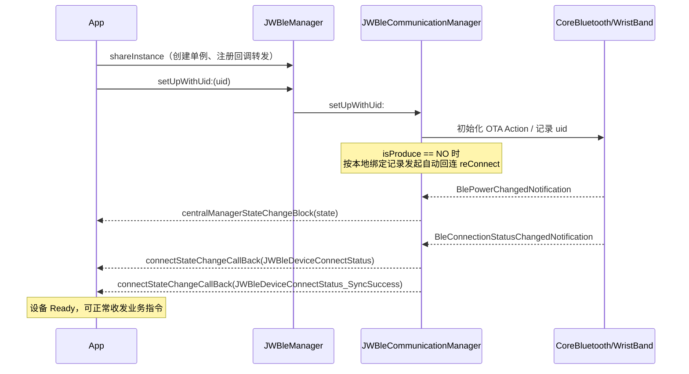

# JWBle SDK 接入指南

> 🌐 语言 / Language: **中文** ｜ [English](SDK_Integration_Guide_EN.md)

> 本文档面向**第三方开发者**，内容与交付的 `JWBle.framework`（**1.3.2**）一致；文中示例代码与随包 Demo 工程一一对应，可直接运行验证。

- 文档版本：JWBle **1.3.2**（与 `JWBle.framework`、`iOS/SDK/` 内交付产物同一构建）
- 覆盖范围：`JWBle.framework` 公开头文件、`iOS/JWBleSdkDemo`（完整功能 Demo）、`iOS/JWBleProtocolDemo`（协议调试 Demo）、`Version Description.md`
- 说明：SDK 能力以**运行时接口返回**为准（`jwCheckFunctionStates:` 等），文档中的能力清单仅用于说明可查询范围。

---

## 一、SDK 简介

### 1.1 基础信息

| 项目 | 内容 | 依据 |
| --- | --- | --- |
| SDK 名称 | JWBle（Wo-Smart 智能穿戴 BLE SDK） | `JWBle/JWBle/JWBle.h` |
| 源码工程 | `JWBle/JWBle.xcodeproj`，target `JWBle` | 工程文件 |
| 交付产物名 | `JWBle.framework` | `productType = com.apple.product-type.framework` |
| Bundle Identifier | `com.wosmart.JWBle` | `PRODUCT_BUNDLE_IDENTIFIER` |
| 支持平台 | iOS（iPhone / iPad） | `TARGETED_DEVICE_FAMILY = "1,2"` |
| 最低系统版本 | iOS 8.0 | `IPHONEOS_DEPLOYMENT_TARGET = 8.0`；交付 framework 的 `MinimumOSVersion = 8.0` |
| 二进制形式 | **静态库打包的 `.framework`**（`MACH_O_TYPE = staticlib`） | 工程设置；`nm` 显示为 `ar archive` |
| 是否支持真机 | 支持（arm64 切片存在） | `lipo -info` 交付产物 |
| 是否支持模拟器 | **部分支持**：仅含 `x86_64` 模拟器切片，**不含 arm64 模拟器切片** | `lipo -info` 交付产物 |
| 是否定义 Module | 是（`DEFINES_MODULE = YES`，附带 `module.modulemap`，可 `@import JWBle;`） | 工程设置 + `Modules/module.modulemap` |
| 是否支持 Swift | 支持（模块化 + 伞形头文件；Swift 侧需桥接 Objective-C API） | `module.modulemap` |
| 运行时报的版本号 | `1.3.2` | `- [JWBleManager sdkInfo]` |
| 打包 Info.plist 版本号 | `1.3.2` | `JWBle.framework/Info.plist` |
| 变更记录最新版本 | `1.3.2` | `Version Description.md` |

> 三处版本号已统一为 **1.3.2**。建议第三方在运行时读取版本号，而不是写死在业务代码里：
> ```objc
> NSString *info = [[JWBleManager shareInstance] sdkInfo];
> NSDictionary *dic = [[JWBleManager shareInstance] sdkInfoDic];
> ```

### 1.2 SDK 依赖

SDK 二进制依赖以下第三方组件（均随仓库提供，第三方接入时必须一并导入）：

| 依赖 | 形式 | 位置 | 用途（依据） |
| --- | --- | --- | --- |
| `RTKLEFoundation.xcframework` | 动态库（含 `ios-arm64`、`ios-arm64_x86_64-simulator`） | `JWBleDemo/JWBleDemo/Vender/JWBle/` | 蓝牙底层框架（`WristBand.m` 等 `#import <RTKLEFoundation/...>`） |
| `RTKOTASDK.xcframework` | 动态库（含 `ios-arm64`、`ios-arm64_x86_64-simulator`） | 同上 | OTA/DFU 升级（`JWBleOTAAction.m` `#import <RTKOTASDK/RTKOTASDK.h>`） |
| `CocoaLumberjack.framework` | 静态，内嵌于 `JWBle.framework/Frameworks/` | 同上 | 日志 |
| `Zip.framework` | 静态 | `JWBle/JWBle/Vender/DFU/` | 表盘资源包解压 |
| `iOSDFULibrary.framework` | 静态 | 随包 `iOS/SDK/` | Nordic DFU 通道；本版公开 OTA 接口走 RTK 通道（`RTKOTASDK`），SDK 代码未引用本库，仅在宿主需要 Nordic DFU 时引入 |
| `RTKAudioConnectSDK.framework` | 动态 | 随包 `iOS/SDK/` | 耳机（音频）功能；`JWBle.framework` 未暴露对应公开接口，仅在宿主需要耳机相关功能时引入（Demo 的耳机页面使用） |
| `libotaclient.a` | 静态库 | `JWBle/JWBle/RTK/Vender/` | OTA 底层 |
| `FMDB` | 源码（`FMDatabase`/`FMDatabaseQueue` 等） | `JWBle/JWBle/RTK/FMDB/` | 本地数据缓存数据库 |

系统框架：`Foundation`、`UIKit`、`CoreBluetooth`（`JWBleDeviceModel.h` `#import <CoreBluetooth/CoreBluetooth.h>`）、`Security`（AES/AES-CBC，`NSData+KKAES`）。
`HealthKit` **不是必需依赖**：`+[Misc addHealthKitSupport]` 为空实现，SDK 未实际调用 HealthKit。
`CoreLocation` **不是依赖**：源码中没有任何 `CLLocationManager` 调用（iOS 13 以后 BLE 扫描不需要定位权限）。

---

## 二、环境要求

| 项目 | 要求 |
| --- | --- |
| 开发工具 | Xcode（交付产物使用 Xcode 16.2 / iOS SDK 18.2 构建） |
| 语言 | Objective-C（SDK 为 Objective-C 实现，Swift 工程可用桥接或 `@import`） |
| 运行系统 | iOS 8.0 及以上（`JWBle.framework` 二进制最低部署版本为 8.0）。工程侧按宿主 App 的部署目标设置即可：Xcode 15+ 要求 ≥ iOS 12.0，Xcode 26/27 要求 ≥ iOS 15.0 |
| 真机 | 必须，蓝牙功能无法在模拟器中使用 |
| 权限 | 蓝牙（`NSBluetoothAlwaysUsageDescription`，iOS 13+ 必需；`NSBluetoothPeripheralUsageDescription` 为 iOS 12 及以下的兼容键） |

---

## 三、SDK 集成

> 当前发布形态为**手动导入 Framework（+ 依赖）**：随包目录 `iOS/SDK/` 提供 `JWBle.framework` 及其依赖，**不提供 CocoaPods 与 Swift Package Manager 集成方式**。

### 3.1 手动集成步骤

**第 1 步：导入主 Framework**

将 `JWBle.framework` 拖入 App 工程：

- `General → Frameworks, Libraries, and Embedded Content` 中添加 `JWBle.framework`。
- 由于是**静态** framework，`Embed` 选项应选择 **`Do Not Embed`**（静态库不能嵌入，否则会出现 `dyld: Symbol not found` 之外的冗余包体问题）。

**第 2 步：导入 SDK 依赖**

把下列文件一并加入工程（路径与 SDK 内 `FRAMEWORK_SEARCH_PATHS` 一致）：

- `RTKLEFoundation.xcframework`（动态，需要 Embed & Sign）
- `RTKOTASDK.xcframework`（动态，需要 Embed & Sign）
- `CocoaLumberjack.framework`（`JWBle.framework/Frameworks/` 内已内嵌，App 侧通常无需重复添加）
- DFU 相关：`Zip.framework`、`iOSDFULibrary.framework`、`libotaclient.a`
- 如使用耳机能力：`RTKAudioConnectSDK.framework`

**第 3 步：Build Settings 配置**

| 设置项 | 值 | 原因 |
| --- | --- | --- |
| `Framework Search Paths` | 指向 `JWBle.framework` 与各依赖所在目录 | 便于 `#import <JWBle/JWBle.h>` |
| `Other Linker Flags` | **必须手工添加 `-ObjC`** | SDK 内部使用 Category（如 `CBPeripheral+Write`、`NSString+JWBle`），静态库不链接 `-ObjC` 时 Category 会被裁掉，运行期会 `unrecognized selector`。注意：SDK 工程自身写的是全角字符 `"－ObjC"`，属于无效配置，**不能依赖 SDK 工程设置，必须在 App 侧显式添加 `-ObjC`** |
| `Other Linker Flags`（如出现符号缺失） | 追加 `-lz`、`-lsqlite3` | 依赖 `Zip.framework`、FMDB |
| `Always Embed Swift Standard Libraries` | 若 App 为纯 Objective-C 且依赖含 Swift，需要开启 | `Zip.framework`/`CocoaLumberjack.framework` 为 Swift 混编产物（`Zip-Swift.h`） |

**第 4 步：导入头文件**

Objective-C：
```objc
#import <JWBle/JWBle.h>
```
Swift：
```swift
import JWBle
// 或使用桥接头文件
```

**第 5 步：配置 Info.plist（权限）**

```xml
<key>NSBluetoothAlwaysUsageDescription</key>
<string>需要使用蓝牙连接智能穿戴设备</string>
<key>NSBluetoothPeripheralUsageDescription</key>
<string>需要使用蓝牙连接智能穿戴设备</string>
```

SDK 实际需要的系统能力仅为：

| 能力 | 是否必需 | 说明 |
| --- | --- | --- |
| Bluetooth 权限 | 必需 | SDK 使用 `CBCentralManager` 扫描/连接 |
| Location 权限 | 不需要 | 源码无定位调用；iOS 13+ 扫描也不再需要 |
| Background Modes | 可选/建议 | SDK 的重连逻辑在 App 进程存活期间工作。若希望 App 退到后台后仍能保持/恢复连接，请在宿主 Target 声明 `bluetooth-central`；SDK 未使用 CoreBluetooth 状态恢复，后台行为由宿主声明决定 |
| HealthKit | 不需要 | 未实际调用 |
| 网络权限 | 不需要 | SDK 不发起网络请求 |
| 通知权限 | 不需要 | 消息通知由 Android/iOS 系统通知（ANCS）通道透传，SDK 只负责“开关”，不申请通知权限 |

---

## 四、SDK 初始化

### 4.1 初始化入口

```objc
// App 启动时（建议一次）
JWBleManager *manager = [JWBleManager shareInstance];
[manager setUpWithUid:@"当前登录用户唯一标识"];   // 必填，代表 App 侧账号
```

- `shareInstance`：懒加载单例；首次创建时会设置 `isAutoShowPair = YES`、`checkUserBinding = YES`、`cacheLogCount = 30`，并注册全部回调转发（`JWBleManager.m` `-__initCallBack`）。
- `setUpWithUid:`：**必须调用**，用于区分账号，落实“绑定关系”语义。同一个 uid 重复调用会被实现直接忽略（`if ([uid isEqualToString:uid]) return;`）。

### 4.2 初始化时序



### 4.3 必须注册的回调

| 回调 | 用途 | 是否必接 |
| --- | --- | --- |
| `JWBleManager.connectStateChangeCallBack` | 连接/绑定/同步/电量/充电/超时等**全量连接状态** | 必须 |
| `JWBleManager.centralManagerStateChangeBlock` | 手机系统蓝牙开关状态 | 强烈建议 |
| `JWBleManager.synchronousDataProgressCallBack` | 历史数据同步进度 | 建议（同步耗时较长） |
| 其余实时数据回调 | 见《SDK_API文档.md》回调清单 | 按功能接入 |

```objc
JWBleManager *manager = [JWBleManager shareInstance];

manager.centralManagerStateChangeBlock = ^(JWBleCentralManagerState state) {
    if (state != JWBleCentralManagerState_PoweredOn) {
        // 提示用户打开蓝牙
    }
};

manager.connectStateChangeCallBack = ^(JWBleDeviceConnectStatus status) {
    switch (status) {
        case JWBleDeviceConnectStatus_Connect:      break; // BLE 已连接
        case JWBleDeviceConnectStatus_BondSuccess:  break; // 绑定成功
        case JWBleDeviceConnectStatus_SyncSuccess:  break; // 设备信息同步完成，设备 Ready
        case JWBleDeviceConnectStatus_SyncFailure:  break; // 同步失败（SDK 会主动断开）
        case JWBleDeviceConnectStatus_DisConnect:   break; // 已断开
        case JWBleDeviceConnectStatus_TimeOutDisconnect: break; // 连接/通信超时断开
        case JWBleDeviceConnectStatus_BatteryUpdate:     break; // 电量变化
        case JWBleDeviceConnectStatus_ChargeStatusChanged: break; // 充电状态变化
        default: break;
    }
};
```

### 4.4 SDK 初始化相关属性（`JWBleManager.h`）

| 属性 | 类型 | 默认 | 说明 |
| --- | --- | --- | --- |
| `showLog` | `BOOL` | `NO` | 是否输出日志 |
| `saveLog` | `BOOL` | `NO` | 是否持久化日志（要求 `showLog == YES`，开启影响性能） |
| `cacheLogCount` | `int` | `30` | 日志批量落盘缓存条数 |
| `isProduce` | `BOOL` | `NO` | 生产/产测模式。置 `YES` 会**关闭自动回连**、关闭 60s 连接超时、解绑时清空本地数据库 |
| `isSNQR` | `BOOL` | `NO` | SN 快速扫描模式：跳过登录/绑定流程，同步完成条件改为 SN 快速条件（不全量获取设备信息），MAC 为全 0 时不覆盖 |
| `isSupportAnonymousUse` | `BOOL` | `NO` | 匿名使用：跳过登录/绑定流程，直接进入绑定成功状态 |
| `isAutoShowPair` | `BOOL` | `YES` | 连接后是否弹出系统配对窗口 |
| `checkUserBinding` | `BOOL` | `YES` | 是否校验用户绑定关系 |
| `checkSpecialOtaShutdown` | `BOOL` | `NO` | 置 `YES` 时，收到设备“OTA 结束查询”响应后会向设备下发“特殊 OTA 关机”指令 |

---

## 五、设备扫描

### 5.1 开始扫描

```objc
[[JWBleManager shareInstance] connectStateChangeCallBack]; // 前一步已注册

[JWBleAction jwStartScanDeviceWithCallBack:^(JWBleDeviceModel *deviceModel) {
    NSLog(@"发现设备 name=%@ mac=%@ rssi=%@ uuid=%@",
          deviceModel.deviceName, deviceModel.macAddress, deviceModel.rssi,
          deviceModel.systemMacAddress);
}];
```

### 5.2 停止扫描

```objc
[JWBleAction jwStopScanDevice];
```

### 5.3 扫描行为说明（依据实现）

| 项目 | 行为 |
| --- | --- |
| 过滤条件 | 按服务 UUID 扫描：`000001ff-3C17-D293-8E48-14FE2E4DA212`（私有主服务）、`000004ff-…`（改名字服务）、`FD50`（涂鸦私有服务）、`00006287-…`（DFU 服务）、`0000e0ff-…`（调试服务）、`180F`（电池服务） |
| 回调线程 | 主线程（`dispatch_async(dispatch_get_main_queue())`） |
| 重复设备 | 按 `CBPeripheral` 对象去重，**同一外设只回调一次**（首次发现回调，后续广播忽略） |
| 广播延迟保护 | 若广播中带有 `FD50` 服务但 `manufacturerData` 为空，会**暂缓回调**，等待后续带厂商数据的广播（`JWBleShouldDeferAdvertisementUntilManufacturerData`），避免 MAC 解析失败 |
| MAC 地址 | 从广播厂商数据解析为 `macAddress`（形如 `AA:BB:CC:DD:EE:FF`）；解析不到时回退为 `CBPeripheral.identifier.UUIDString` |
| `systemMacAddress` | 原始广播数据字符串；无广播上下文时回退为 `CBPeripheral.identifier.UUIDString` |
| RSSI | 来自广播；无广播上下文时为 `@0` |
| 扫描超时 | **SDK 不会自动停止扫描**（`stopScanTimer` 未在扫描开始时启动）。需要三方自行控制扫描时长，并调用 `jwStopScanDevice` |
| 系统已连接设备 | 扫描时会一并查询 iOS 系统当前已连接的目标服务外设并回调 |
| 自动回连影响 | 非产测模式下，SDK 每 3 秒轮询一次系统已连接设备用于自动回连（`WristBand.scanTimer`），会持续使用蓝牙扫描 |

### 5.4 扫描结果模型（`JWBleDeviceModel`）

扫描阶段即可用的字段：`deviceName`、`rssi`、`macAddress`、`systemMacAddress`、`per`、`advertisementData`。
其余字段（`versionName`、`versionCode`、`power`、`deviceNumber`、`functionData`、`functionDataV2`、`hideFunctionMenu`、`chargIng`、`headsetPaired`、`deviceStatusTypeArr`、`customizedFunctionDic`、`chipType`、`platform`、`DeviceInfoData`）在**连接并同步成功后**才有值。

---

## 六、设备连接、状态与断开

### 6.1 连接设备

```objc
[JWBleAction jwConnectDevice:deviceModel];   // deviceModel 来自扫描回调
```

实现约束（`JWBleCommunicationManager.-connectPeripherals:`）：

- 入参 `nil` 且当前已连接时直接返回，不发起连接。
- 连接前会清空上一次缓存的 `functionDataV2`（`NSUserDefaults`）。
- 连接 60 秒内未完成同步会判定超时（仅 `isProduce == NO` 时启用），回调 `JWBleDeviceConnectStatus_TimeOutDisconnect` 并主动断开。

### 6.2 四层连接状态（关键概念）

第三方必须区分以下 4 个层次，SDK 通过 `connectStateChangeCallBack` 依次上报：

| 层次 | 对应枚举 | 含义 |
| --- | --- | --- |
| 1. BLE 已连接 | `JWBleDeviceConnectStatus_Connect` | 蓝牙链路建立（`CBPeripheralStateConnected`），此时**还没拿到设备信息** |
| 2. 绑定成功 | `JWBleDeviceConnectStatus_BondSuccess` | 设备绑定/登录成功 |
| 3. 设备信息同步完成 | `JWBleDeviceConnectStatus_SyncSuccess` | 功能列表、设备信息、隐藏功能、电量、MAC、版本等全部就绪 → **设备 Ready** |
| 4. 可正常收发业务指令 | 建议以 `SyncSuccess` 为界 | 同步完成前调用业务 API 可能失败或返回 `Busy` |

同步成功后会填充 `JWBleManager.connectionModel`（`JWBleDeviceModel`），这是后续读写设备信息的主要数据源。

### 6.3 判断连接状态

```objc
JWBleManager *m = [JWBleManager shareInstance];
BOOL connected         = m.isConnected;         // 非 DisConnect 即为 YES
BOOL connecting        = m.isConnecing;         // 正在连接/连接中
JWBleDeviceConnectStatus st = m.deviceConnectStatus; // 最近一次状态
JWBleDeviceModel *dev  = m.connectionModel;     // 已连接设备（未连接时为 nil）
```

> 注意：`isConnected` 是**只实现了 getter 的属性**（`JWBleManager.m` 中只有 `-isConnected`），头文件却声明为可读写，三方**不要对其赋值**。

### 6.4 断开

```objc
[JWBleAction jwDisConnect];            // 断开并解绑（会清空本地设备信息表与血压配置表）
[JWBleAction jwDisConnectNotUnBond];   // 断开但保留绑定关系
[JWBleAction jwRemoveConnectRecord:@""]; // 删除连接记录（传 "" 直接删除，传 UUID 则匹配后删除）
```

| 断开场景 | 触发方式 | 回调状态 |
| --- | --- | --- |
| App 主动断开（解绑） | `jwDisConnect` | `DisConnect` |
| App 主动断开（不解绑） | `jwDisConnectNotUnBond` | `DisConnect` |
| 设备侧异常断开 / 信号丢失 | 系统回调 `didDisconnectPeripheral` | `DisConnect` |
| 手机蓝牙关闭 | `BlePowerChangedNotification` | `DisConnect` + `centralManagerStateChangeBlock(PoweredOff)` |
| 系统配对信息被删除 | `CBErrorPeerRemovedPairingInformation` | `BleRemovedPairingInformation` |
| 连接/通信超时 | 60s 连接超时或通信超时 | `TimeOutDisconnect` |
| 同步失败 | 同步流程返回失败 | `SyncFailure` + SDK 主动断开 |

### 6.5 自动重连

| 项目 | 行为 |
| --- | --- |
| 是否支持 | 支持 |
| 开关 | 由 `JWBleManager.isProduce` 控制：`isProduce == NO`（默认）开启，`isProduce == YES` 完全关闭 |
| 重连条件 | 本地存在绑定记录（设备 UUID），且当前未连接、非 App 主动断开（`activeDisconnect == NO`）、未达到“重试上限”标记 |
| 重连触发点 | ① `setUpWithUid:` 时；② 系统蓝牙开启时；③ 非主动断开时立即 `connectPeripheral:`；④ 每 3 秒一次的系统已连接设备轮询（`SCAN_TIME_INTERVAL = 3`） |
| 重连次数 / 周期 | 未实现固定次数上限，属于**持续重试**，周期 3 秒（基于系统已连接设备轮询） |
| 主动断开后 | 不重连（`activeDisconnect = YES`） |
| 产测模式 | 不重连，且解绑时清空本地数据库 |

> 结论：SDK 没有暴露“开启/关闭自动重连”的公开属性，只能通过 `isProduce` 间接控制（但 `isProduce` 另有产测语义，第三方 App 不应依赖它）。

---

## 七、功能调用总览

调用任何业务 API 前，请确保：

1. 已 `setUpWithUid:`；
2. 系统蓝牙为 `PoweredOn`；
3. 已收到 `SyncSuccess`（设备 Ready）；
4. 目标功能在当前设备上受支持（先用能力查询接口判断，见《SDK设备能力矩阵.md》）；
5. 当前没有正在执行的历史数据同步/OTA（部分接口会返回 `JWBleCommunicationStatus_Busy`）。

### 7.1 功能模块与入口对照表

| 功能模块 | 主要入口 | 结果获取方式 |
| --- | --- | --- |
| 扫描/连接/断开 | `JWBleAction` | `jwStartScanDeviceWithCallBack:` + `connectStateChangeCallBack` |
| 用户信息（年龄/性别/身高/体重） | `jwSynchronizePersonalInformation:isMan:height:weight:callBack:` | 方法内 Block |
| 目标设置（步数/卡路里/睡眠） | `jwSetStepTargetAction:`、`jwSetCalorieTargetAction:`、`jwSetSleepTargetAction:` | 方法内 Block |
| 设备设置（时间/单位/语言/亮度/亮屏/抬腕/勿扰/久坐/闹钟/消息通知/锁屏/倒计时） | `JWBleAction`（见 API 文档第三章） | 方法内 Block |
| 健康点测（心率/血压/血氧/体温/血糖） | `jwTestHRAction:`、`jwTestBPAction:`、`jwTestOxygen:`、`jwTestTemperatureAction:`、`jwTestBloodGlucoseAction:` | 方法内 Block（读值），连续监测走 `JWBleManager` 的实时回调 |
| 实时数据（心率/体温/运动） | `jwRealTimeHeartRateAction:`、`JWBleManager.realTimeHeartRateCallBack` 等 | `JWBleManager` 属性 Block |
| 历史数据同步 | `[JWBleDataAction jwSyncDataWithCallBack:]` | 方法内 Block（分段状态） |
| 历史数据读取 | `JWBleDataAction` 各 `jwGetXxxByYYYYMMDDStr:` | 方法内 Block（**读本地数据库**） |
| 多运动控制（App 控制设备运动） | `jwQueryDeviceMotionStatus:`、`jwStartDeviceMotion:`、`jwPauseDeviceMotion:`… | 方法内 Block + `deviceMotionStatusChangeCallBack` / `deviceMotionRealtimeDataCallBack` |
| OTA / 资源升级 | `JWBleOTAAction`（+ `jwCheckOTAEnableWithCallBack:`） | `JWBleDFUCallBack` |
| 表盘自定义 | `JWBleCustomizeMainInterfaceAction` | `actionCallBack` + `updateCallBack` |
| 工具换算 | `JWBlePublicHelp` | 同步返回值 |
| 日志 | `JWLogAction`、`JWBleManager.showLog/saveLog` | 同步返回值 |

### 7.2 指令返回语义（重要）

SDK 的写类接口普遍存在两种返回语义，第三方必须区分：

1. **“已下发”语义**：方法内部只把指令写入蓝牙发送队列，随后立即以 `JWBleCommunicationStatus_Success` 回调，**并不代表设备已执行**。
   例：`jwSynchronizePersonalInformation:…`、`jwSetStepTargetAction:`、`jwFindDeviceWithCallBack:`、`jwRemotePhotography:callBack:`（`JWBleAction.m` 中调用 `commonResponCallBack:status:JWBleCommunicationStatus_Success`）。
2. **“设备已响应”语义**：读取类接口（`isGet == YES`）会等待设备回包再回调，`status` 才是设备的真实应答结果。

统一约束（`+[JWBleAction checkDeviceConnection:]`，多数接口使用）：

| 返回状态 | 含义 |
| --- | --- |
| `JWBleCommunicationStatus_Success` | 指令已下发 / 设备应答成功 |
| `JWBleCommunicationStatus_Faild` | 未连接或通信失败 |
| `JWBleCommunicationStatus_IsDFUModel` | 设备处于 DFU 模式，指令被拒绝 |
| `JWBleCommunicationStatus_Busy` | 设备正在同步运动历史数据（`band.sportHisSyncIng == YES`） |
| `JWBleCommunicationStatus_PWDError` | 通信密码错误 |

---

## 八、健康数据同步与读取

### 8.1 同步（从设备拉取历史数据到本地库）

```objc
[JWBleDataAction jwSyncDataWithCallBack:^(JWBleCommunicationStatus status, JWBleSyncStateEnum syncState) {
    switch (syncState) {
        case JWBleSyncEnum_Start:            break; // 开始
        case JWBleSyncEnum_Complete:         break; // 完成
        case JWBleSyncEnum_Interrupt:        break; // 中断
        case JWBleSyncEnum_InconsistentTotals: break; // 总数不一致
        default: break;
    }
}];

// 进度（0...total 的分片进度）
[JWBleManager shareInstance].synchronousDataProgressCallBack = ^(int curPackageIndex, int packageCount) {
    // 更新 UI
};
```

前置条件：设备已连接（`isConnected`）；设备不处于 DFU 模式。

### 8.2 读取历史数据（**读本地数据库，不是读设备**）

所有 `JWBleDataAction getter` 都是**同步读本地 SQLite（FMDB）**，数据来自上一次 `jwSyncDataWithCallBack:` 的结果：

```objc
// 步数：固定返回 96 条（每 15 分钟一条，00:00 ~ 23:45）
[JWBleDataAction jwGetStepDataByYYYYMMDDStr:@"20260928" callBack:^(NSArray *dataArr) {
    for (NSDictionary *d in dataArr) {
        // @{@"offset":@0, @"steps":@11, @"calory":@22, @"distance":@33}
    }
}];

// 心率：按时间戳升序
[JWBleDataAction jwGetHRDataByYYYYMMDDStr:@"20260928" callBack:^(NSArray *dataArr) { }];
```

日期格式为 `yyyyMMdd` 字符串；另有一组 `jwGetXxxByStartT:endT:callBack:` 按时间戳区间查询。

### 8.3 数据删除与去重

```objc
[JWBleDataAction jwRemoveDataTimeLessThan:t];                 // 删除某时间戳之前的全部数据
[JWBleDataAction jwRemoveDataTimeLessThan:t dataType:type];   // 按数据类型删除
[JWBleDataAction jwRemoveDataTime:t dataType:type];           // 删除某时间戳的数据
[JWBleDataAction jwFixDBData];                                // 修复 jwDeviceDataReset 后重复数据问题
[JWBleAction jwDeviceDataReset];                              // 重置设备数据下标
```

> `jwDeviceDataReset` 后建议立即执行 `jwRemoveDataTimeLessThan:`，否则会出现数据重复（头文件明确说明）。

### 8.4 读取接口的返回值约定

- 所有 getter 都是**纯只读**：不会修改数据库，同一时间范围重复调用结果稳定（2026-09-29 修复）。
- 同一时间戳只返回**第一条**（去重语义保留）；`time <= 0` 的无效记录会被跳过。
- 需要清理历史数据时使用显式接口：`jwRemoveDataTimeLessThan:dataType:`、`jwRemoveDataTime:dataType:`、`jwFixDBData`。
- `jwGetStepDataByYYYYMMDDStr:` 固定返回 96 条，`steps` / `calory` / `distance` / `offset` 全部为 `NSNumber`。

---

## 九、OTA 升级

```objc
// 1. 升级前检查设备是否可升级
[JWBleAction jwCheckOTAEnableWithCallBack:^(JWBleCommunicationStatus status, int deviceStatus) {
    // deviceStatus: 0 可直接静默升级；1 设备繁忙，需提示用户
}];

// 2. 执行升级
NSData *firmware = [NSData dataWithContentsOfFile:@"..." options:0 error:nil];
[[JWBleOTAAction shareInstance] startOTAV2ForWithData:firmware
                          prefersUpgradeUsingOTAMode:YES
                                           callBack:^(NSInteger didSend, NSInteger totalLength, JWBleDeviceDFUStatus dfuStatus) {
    // 进度 = didSend / totalLength；状态见 JWBleDeviceDFUStatus
}];
```

可用的三个重载：

| 方法 | 说明 |
| --- | --- |
| `startOTAV2ForWithData:prefersUpgradeUsingOTAMode:andPeripheral:callBack:` | 指定外设升级 |
| `startOTAV2ForWithData:prefersUpgradeUsingOTAMode:callBack:` | 使用当前已连接设备升级 |
| `startOTAV2ForWithData:prefersUpgradeUsingOTAMode:fsblMode:versionString:callBack:` | 带 FSBL（Secure Boot Loader）版本校验，版本一致时跳过升级并回调 `JWBleDeviceDFUStatus_VersionConsistent` |

另有 `cancelAllPeripheralConnections` 可取消全部外设连接。

前置条件与注意事项：

- 升级包 `data` 为空 → 立即回调 `JWBleDeviceDFUStatus_FileNotExist`；
- 当前没有可用外设（`connedModel.per == nil`）→ 立即回调 `JWBleDeviceDFUStatus_PeripheralIsNull`；
- 升级中 `JWBleDeviceModel.otaIng` 为 `YES`，SDK 会忽略扫描请求；
- 升级完成后建议重新连接并重新同步。

---

## 十、最小接入完整流程

```objc
// 0. 集成：导入 JWBle.framework + 依赖，Other Linker Flags 加 -ObjC
//    在 Info.plist 配置 NSBluetoothAlwaysUsageDescription

// 1. 初始化
JWBleManager *m = [JWBleManager shareInstance];
[m setUpWithUid:@"user_123"];

// 2. 监听蓝牙状态
m.centralManagerStateChangeBlock = ^(JWBleCentralManagerState state) {
    if (state == JWBleCentralManagerState_PoweredOn) {
        [JWBleAction jwStartScanDeviceWithCallBack:^(JWBleDeviceModel *dev) {
            // 3. 扫描到设备后按需展示（建议去重/按 RSSI 排序）
        }];
    }
};

// 4. 监听连接状态
m.connectStateChangeCallBack = ^(JWBleDeviceConnectStatus st) {
    if (st == JWBleDeviceConnectStatus_SyncSuccess) {
        [self onDeviceReady];   // 5. 设备 Ready
    }
};

// 6. 用户选择设备后连接
[JWBleAction jwStopScanDevice];
[JWBleAction jwConnectDevice:selectedDevice];

// 7. 设备 Ready 后：设置用户信息
- (void)onDeviceReady {
    [JWBleAction jwSynchronizePersonalInformation:28 isMan:YES height:175.0 weight:68.0
                                         callBack:^(JWBleCommunicationStatus status) { }];

    // 8. 同步历史数据
    [JWBleDataAction jwSyncDataWithCallBack:^(JWBleCommunicationStatus status, JWBleSyncStateEnum state) {
        if (state == JWBleSyncEnum_Complete) {
            // 9. 读取数据（读本地库）
            [JWBleDataAction jwGetStepDataByYYYYMMDDStr:@"20260928" callBack:^(NSArray *arr) { }];
            [JWBleDataAction jwGetHRDataByYYYYMMDDStr:@"20260928" callBack:^(NSArray *arr) { }];
        }
    }];

    // 10. 监听实时心率
    JWBleManager.shareInstance.realTimeHeartRateCallBack = ^(NSInteger hrValue) {
        // hrValue == -999 表示设备主动停止
    };
    [JWBleAction jwRealTimeHeartRateAction:YES callBack:^(JWBleCommunicationStatus status,
                                                        JWBleRealTimeHeartRateStateEnum state) { }];
}

// 11. 断开
[JWBleAction jwDisConnect];
```

---

## 十一、注意事项（第三方必读）

1. **必须链接 `-ObjC`**，否则内部 Category 不生效，运行期崩溃。
2. **必须在 `SyncSuccess` 之后再调用业务 API**，并用能力查询接口判断功能支持。
3. **写类接口的 `Success` 只代表“指令已下发”**，不代表设备执行成功；需要确认结果时请使用带读取（`isGet == YES`）的接口。
4. **不要在短时间内并发下发大量指令**：SDK 内部为串行发送队列，且同一类读取指令同时只能有一个待响应（多运动控制为 6 秒超时、仅允许一个待处理请求）。请串行调用。
5. **历史数据必须先同步再读取**：`JWBleDataAction` 的 getter 读的是本地数据库。
6. **日期字符串统一 `yyyyMMdd`**（如 `20260928`）；部分接口按 Unix 秒级时间戳（`NSInteger`）查询。
7. **读取接口为纯只读**：同一时间戳只返回第一条，重复调用结果稳定；需要清理数据请调用显式删除接口。
8. **单位**：身高 `cm`、体重 `kg`、距离 `米`、卡路里 `卡`（界面展示时设备端取整、公里四舍五入）、温度部分接口为摄氏度 ×10（如 `365` 表示 36.5℃）。
9. **`isProduce` 不要在生产 App 中置 `YES`**，它会关闭自动重连、关闭连接超时保护并清库。
10. **模拟器**：交付的 `JWBle.framework` 只含 `x86_64` 模拟器切片，Apple Silicon 模拟器可能无法直接链接（需使用 Rosetta 或 x86_64 模拟器架构）；蓝牙功能本身也无法在模拟器验证。
11. **日志**：`showLog` 会输出大量蓝牙交互日志，上线前请关闭；`saveLog` 会落盘并影响性能。
12. **本地数据库**：SDK 会在 App 沙盒内创建 SQLite 数据库缓存设备与健康数据，卸载/清理数据会导致历史数据丢失。

---

## 附录：交付 framework 头文件清单（21 个）

`JWBleDemo/JWBleDemo/Vender/JWBle/JWBle.framework/Headers/` 中实际交付给第三方的头文件：

```
JWBle.h                              JWBleAction.h
JWBleDataAction.h                    JWBleManager.h
JWBlePublicDefine.h                  JWBlePublicModelDefine.h
JWBlePublicHelp.h                    JWBleOTAAction.h
JWBleDeviceModel.h                   JWBleAlarmClockModel.h
JWBleMedicationReminderModel.h       JWNotDisturbModel.h
JWBleWeatherModel.h                  JWCountDownModel.h
JWOxygenModel.h                      JWLogAction.h
JWLogModel.h                         JWBleDBModel.h
JWBleCustomizeMainInterfaceAction.h  JWBleCustomizeMainInterfaceActionConfigModel.h
JWBleMyMainInterfaceAction.h
```

> 以上清单与交付的 1.3.2 `JWBle.framework/Headers` 完全一致（含 `JWBleHeatStressReminderModel.h`、`JWBleMotionStatusModel.h`、`JWBleMotionRealtimeDataModel.h`）。
