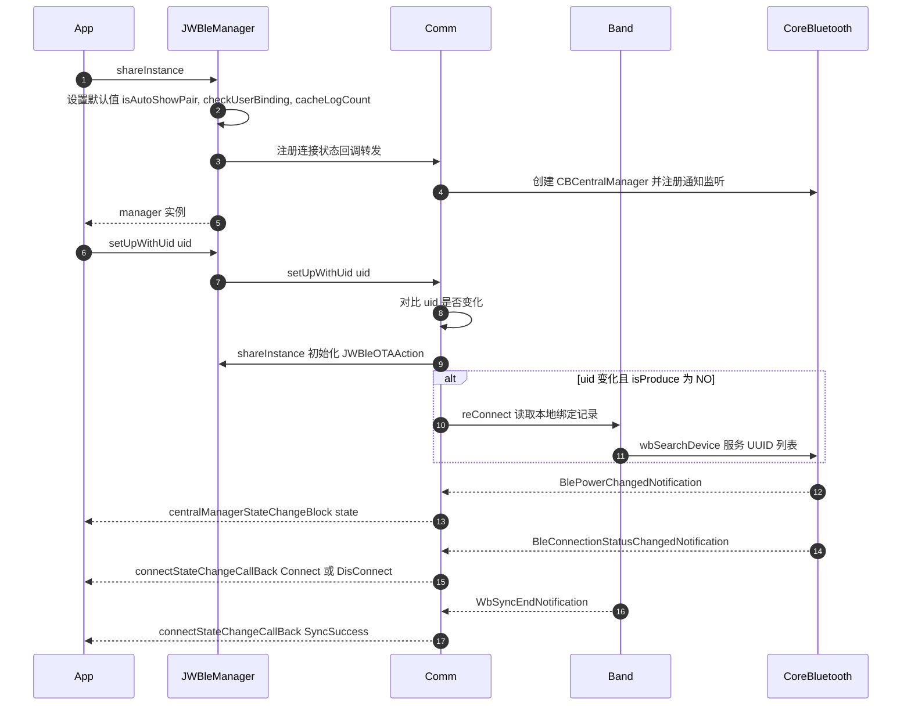
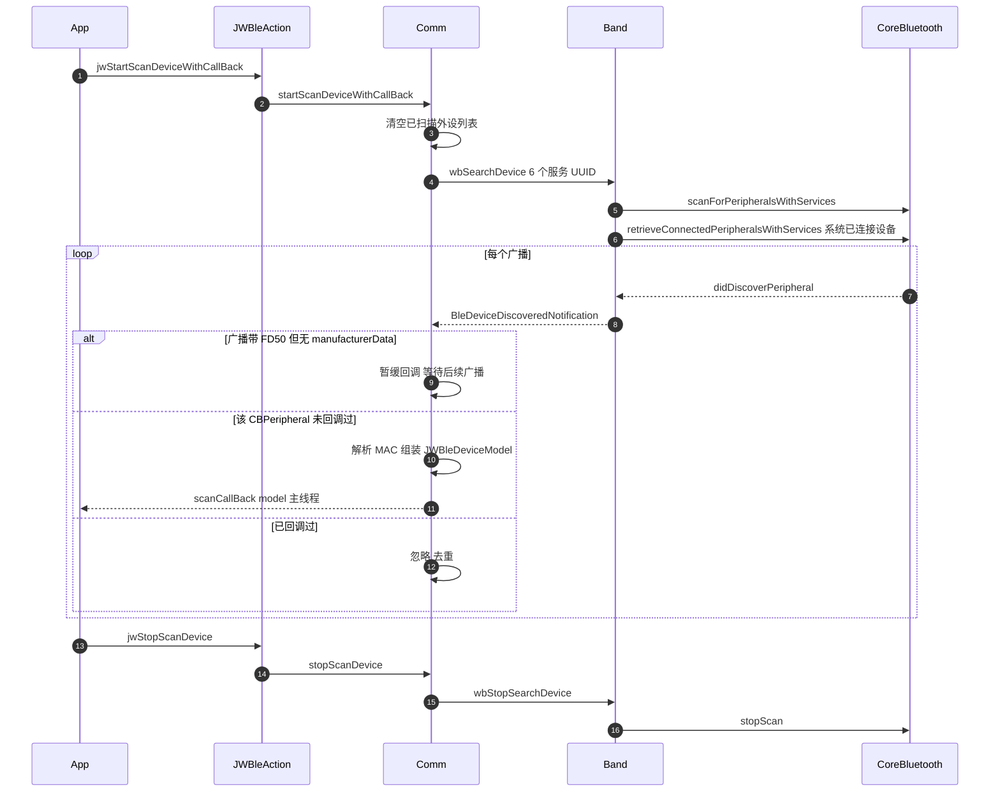
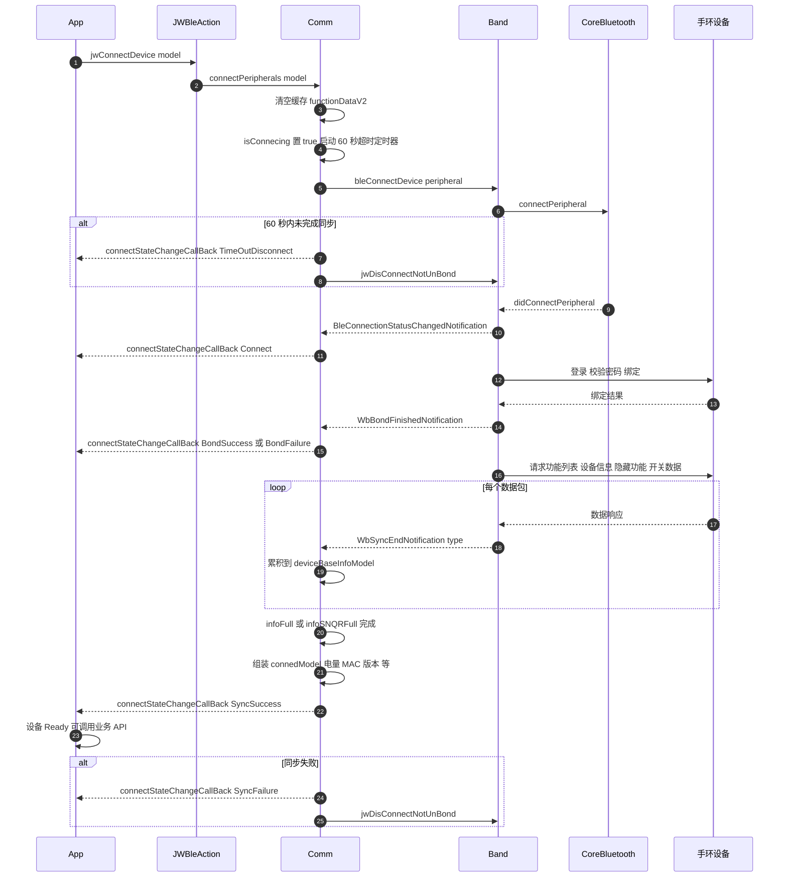
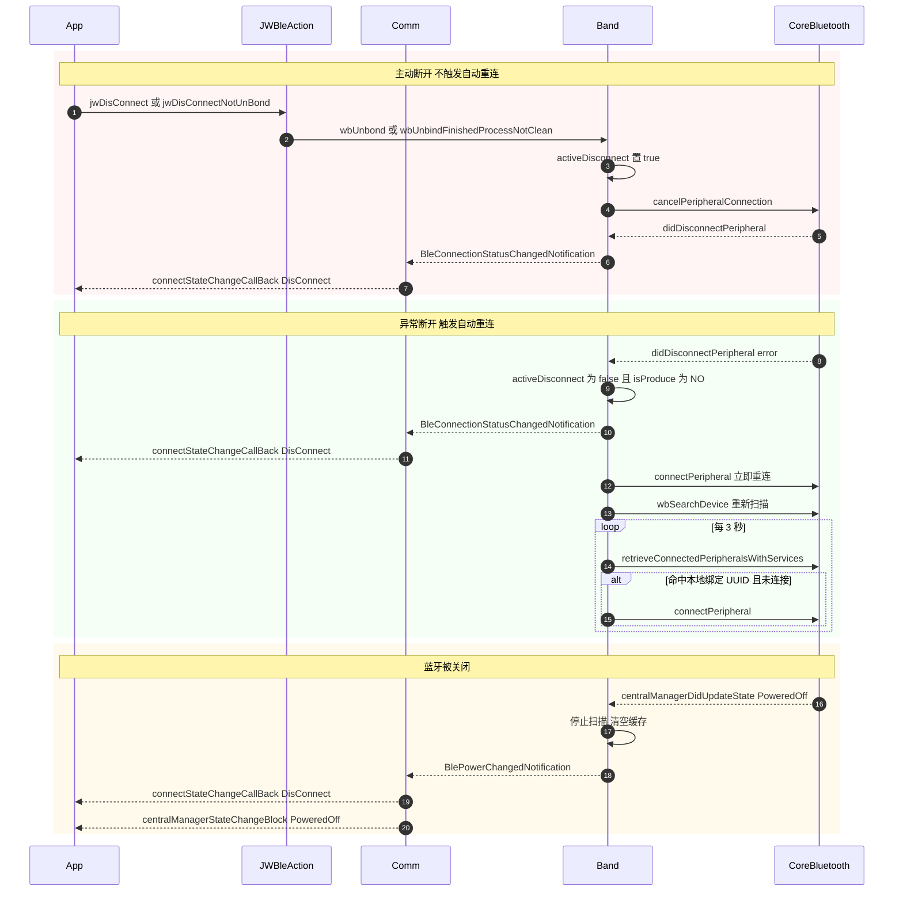
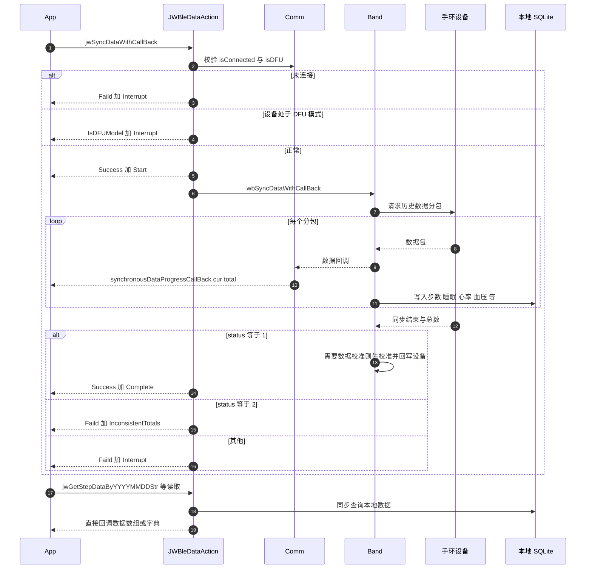
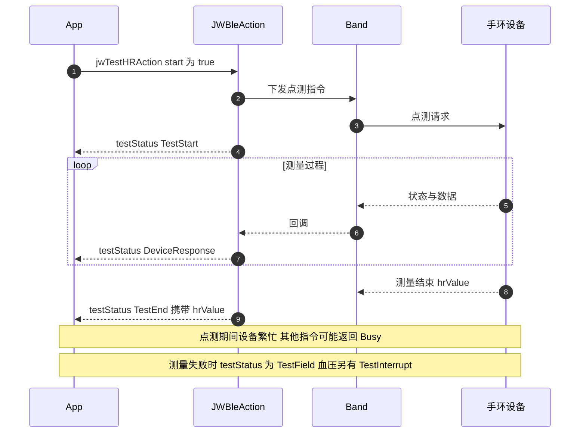
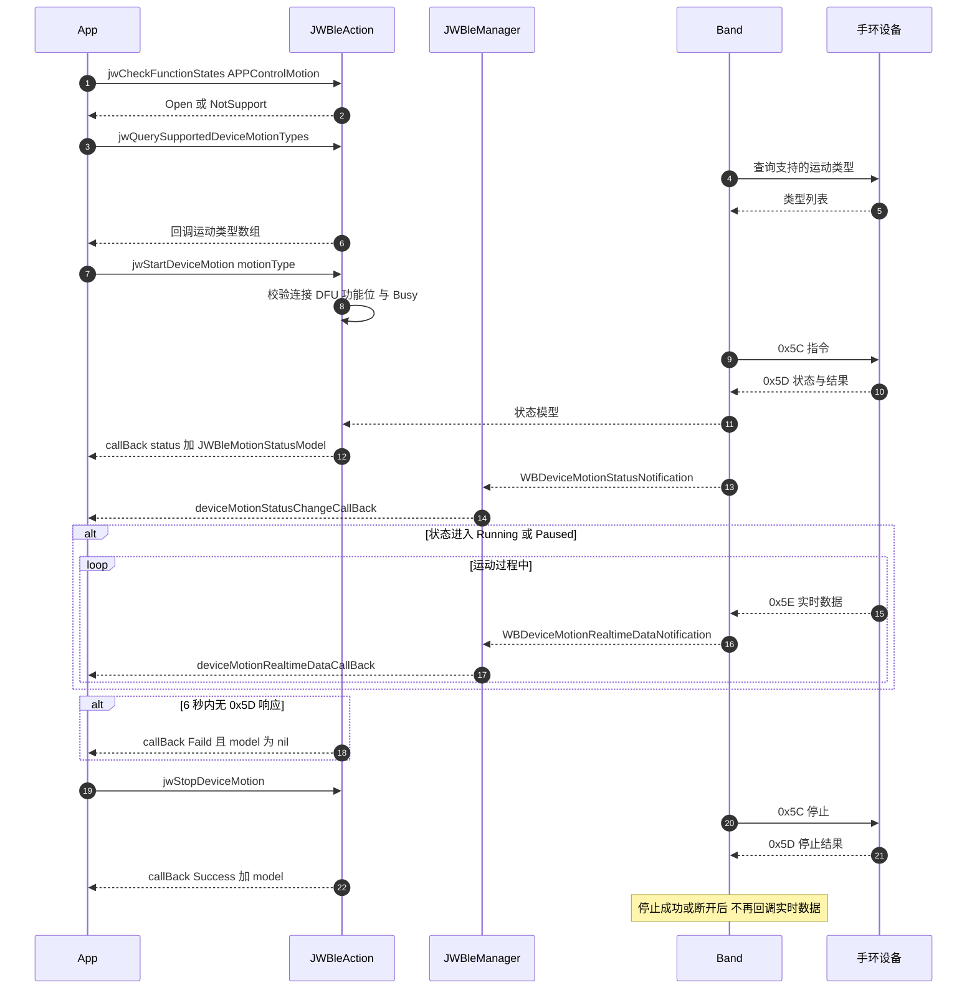
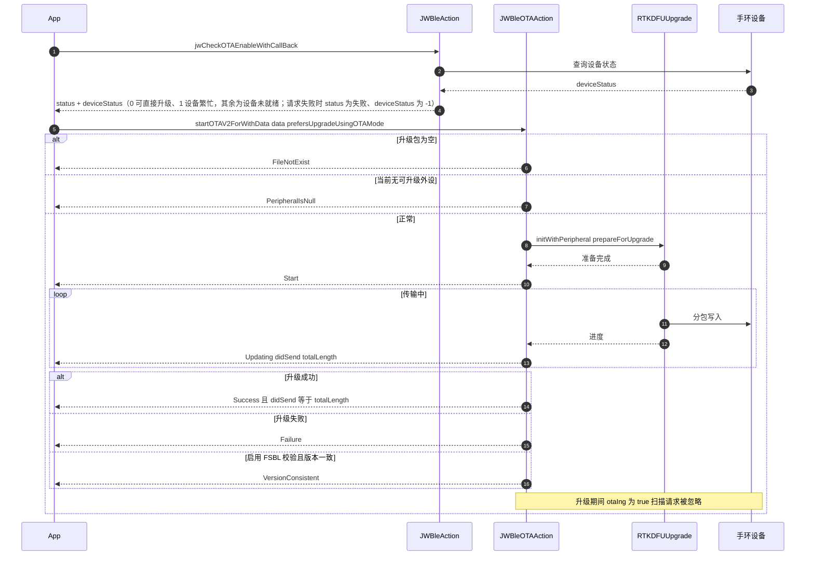
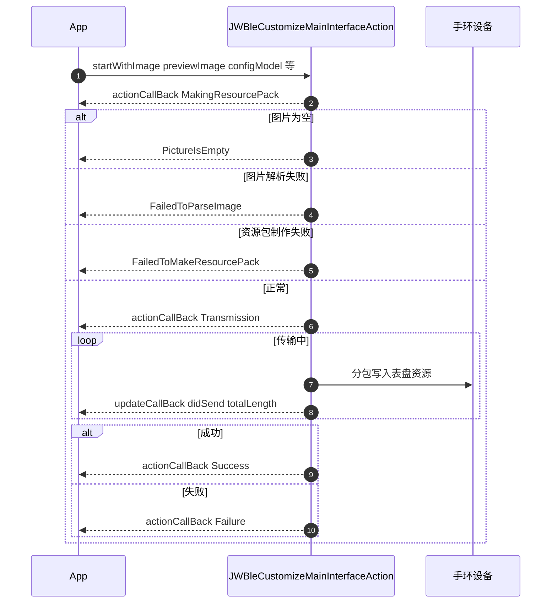

# JWBle SDK 调用时序图

> 🌐 语言 / Language: **中文** ｜ [English](SDK_Call_Flow_Diagrams_EN.md)

> 全部时序图依据当前 SDK 源码绘制（`JWBleManager`、`JWBleCommunicationManager`、`WristBand`、`WristBandEvent`、`JWBleAction`、`JWBleDataAction`、`JWBleOTAAction`）。
> 图中「Comm」= `JWBleCommunicationManager`（内部实现，不对外暴露），「Band」= `WristBand`（内部实现）。
> 第三方只能看到 `JWBleManager` / `JWBleAction` / `JWBleDataAction` / `JWBleOTAAction` 这一层，其余参与者用于说明内部时序。

---

## 一、SDK 初始化时序

**关键点**

- 未调用 `setUpWithUid:` 时不会触发自动回连。
- `uid` 与上次相同则整段初始化被忽略。
- 初始化阶段就会注册系统蓝牙状态回调，App 可立即获知 `PoweredOn` 并开始扫描。

---

## 二、设备扫描时序

**关键点**：SDK 不会自动停止扫描，也没有扫描超时；同一外设只回调一次。

---

## 三、设备连接时序（含绑定与同步）

**四层状态对照**

| 层次 | 回调 | 含义 |
| --- | --- | --- |
| BLE 链路建立 | `Connect` | 仅蓝牙连上，设备信息尚未获取 |
| 绑定完成 | `BondSuccess` | 登录/绑定成功 |
| 信息同步完成 | `SyncSuccess` | 功能列表、设备信息、电量、MAC、版本等就绪 → **设备 Ready** |
| 可正常收发指令 | 以 `SyncSuccess` 为界 | 之前调用业务 API 可能失败 |

---

## 四、断开与自动重连时序

**关键点**：自动重连**只受 `isProduce` 控制**，没有公开的开关属性，也没有次数上限（持续重试）。

---

## 五、健康数据同步时序

**关键点**：读取接口**不访问设备**，只读本地数据库；重复读取部分接口会删除重复记录（见《SDK_API文档.md》6.2 节）。

---

## 六、健康点测时序（以心率为例）

---

## 七、多运动控制时序

**关键点**：同一时刻只允许一个待处理的多运动请求；设备响应才是权威结果。

---

## 八、OTA 升级时序

---

## 九、表盘自定义时序

---

## 十、时序图汇总表

| 时序 | 起点 API | 结果回调 |
| --- | --- | --- |
| SDK 初始化 | `shareInstance` + `setUpWithUid:` | `centralManagerStateChangeBlock`、`connectStateChangeCallBack` |
| 设备扫描 | `jwStartScanDeviceWithCallBack:` | `JWBleReceiveScanningDeviceCallBack` |
| 设备连接 | `jwConnectDevice:` | `connectStateChangeCallBack`（`Connect` → `BondSuccess` → `SyncSuccess`） |
| 断开/重连 | `jwDisConnect` 等 | `connectStateChangeCallBack`（`DisConnect` / `TimeOutDisconnect`） |
| 数据同步 | `jwSyncDataWithCallBack:` | `JWBleSyncCallBack` + `synchronousDataProgressCallBack` |
| 数据读取 | `JWBleDataAction` getter | 方法内 Block（读本地库） |
| 点测 | `jwTestHRAction:` 等 | 方法内 Block（测试状态机） |
| 多运动 | `jwStartDeviceMotion:` 等 | 方法内 Block + `deviceMotionStatusChangeCallBack` / `deviceMotionRealtimeDataCallBack` |
| OTA | `startOTAV2ForWithData:…` | `JWBleDFUCallBack` |
| 表盘自定义 | `startWithImage:…` | `JWBleCustomizeMainInterfaceActionCallBack` + `JWBleDFUCallBack` |
